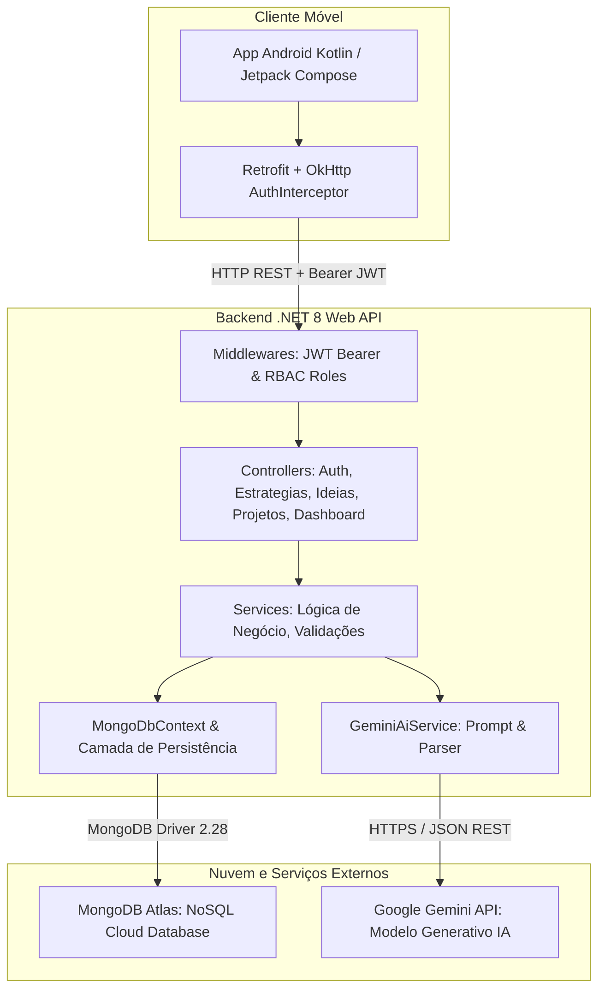

# Diagrama e Arquitetura do Backend - Sprint 2

## Visão Geral da Arquitetura

A solução da Sprint 2 foi projetada seguindo as melhores práticas de Engenharia de Software, adotando uma arquitetura em camadas limpas (*Clean Architecture / N-Tier Architecture*), com separação rigorosa de responsabilidades e alta coesão:

---

## Detalhamento das Camadas do Backend

1. **Camada de Apresentação (Controllers):**
   - Recebem requisições HTTP, validam os DTOs de entrada e retornam respostas com códigos de status HTTP semânticos (`200 OK`, `201 Created`, `204 NoContent`, `400 BadRequest`, `401 Unauthorized`, `403 Forbidden`, `404 NotFound`).
   - Aplicam anotações declarativas de segurança (`[Authorize]`, `[Authorize(Roles = "Lider")]`, `[Authorize(Roles = "Gestor,Lider")]`).

2. **Camada de Segurança (Security / Identity):**
   - Autenticação stateless via **JWT (JSON Web Token)** assinado com HMAC-SHA256.
   - Criptografia de senhas com algoritmo **BCrypt** com fator de custo (*work factor*).
   - Claims de perfil (`Operador`, `Gestor`, `Lider`) incorporadas no token para autorização instantânea sem necessidade de consultas extras ao banco em cada requisição.

3. **Camada de Negócio (Services):**
   - Centraliza as regras operacionais:
     - `UsuarioService`: Registro, autenticação e validação de credenciais.
     - `EstrategiaService`: Gerenciamento do histórico estratégico da empresa.
     - `IdeiaService`: Recepção das ideias, associação à estratégia vigente e orquestração do cálculo de Score com a IA.
     - `ProjetoService`: Ciclo de vida das iniciativas, etapas (Ideação, Prototipação, Piloto, Escala) e dados de ROI/resultados.
     - `DashboardService`: Agregações analíticas para a tomada de decisão executiva.
     - `GeminiAiService`: Comunicação com a API generativa do Google Gemini.

4. **Camada de Dados (Repositories / Models):**
   - Mapeamento de documentos BSON/JSON do **MongoDB Atlas**.
   - Resiliência integrada com fallback inteligente em memória caso a conexão externa do cluster esteja inacessível no momento da avaliação.
